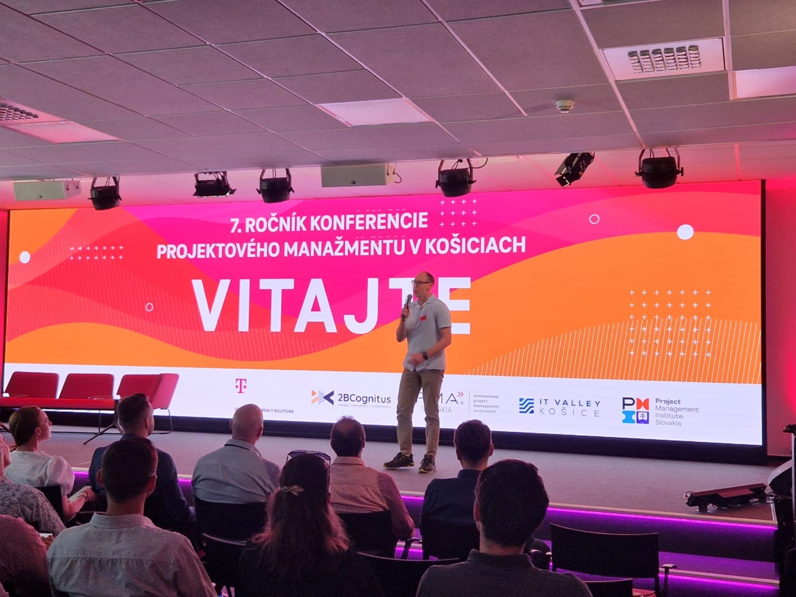

We're proud to share that Dr. Oleksii Yehorchenkov presented the DREAMER project at the **7th Annual Project Management Conference in Košice, Slovakia**!

In his talk, Dr. Yehorchenkov introduced the DREAMER project, outlining its mission, objectives, and key strategies aimed at supporting Ukraine's post-war recovery through advanced project management, digital transformation, clean energy initiatives, and sustainable development.

Special thanks to the conference partners: 2BCognitus, DT IT Solutions Slovakia, IPMA Slovakia, Ko3ice IT Valley, and especially for PMI Slovakia Chapter for providing this excellent platform to discuss innovative solutions and collaborative opportunities.
