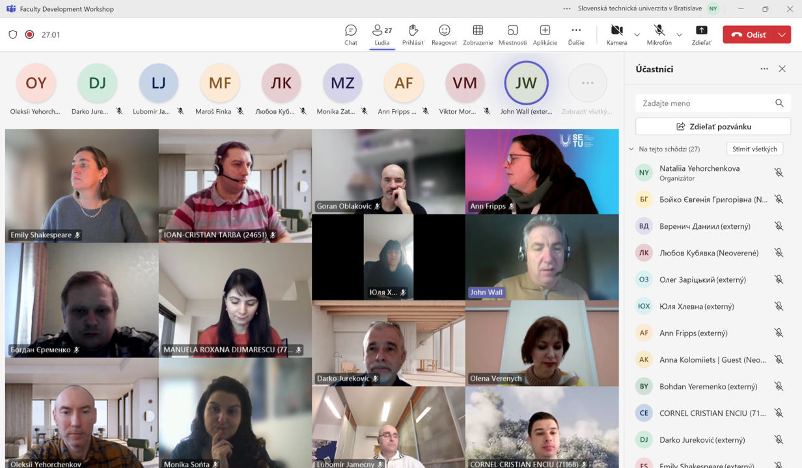

February 11, 2025 we held the first session of our **Faculty Development Workshop** within the DREAMER project! It was a fruitful discussion on effective methods for providing learning materials in module development.
We also gained valuable insights from our partners from Kyiv National University of Construction and Architecture, drawing on their previous experiences to enhance our approach. The exchange of ideas was inspiring, reinforcing the collaborative spirit that drives this project forward!
Thank you to everyone who contributed—your input and expertise are key to enhancing our educational practices!
Looking forward to the next sessions and continuing this exciting journey in shaping the future of project management education.

